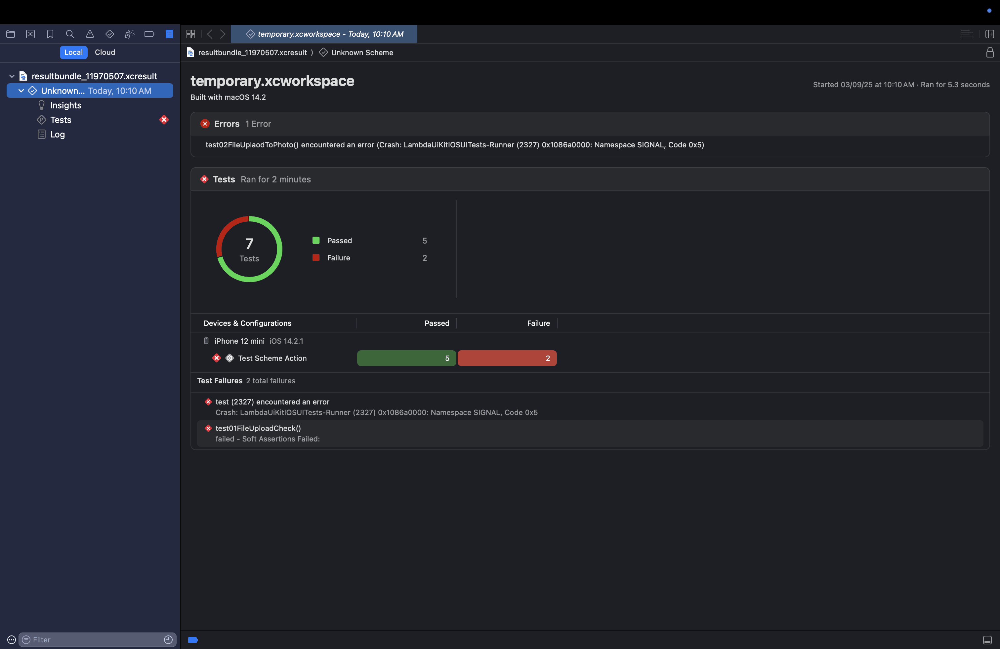

import CodeBlock from '@theme/CodeBlock';
import Tabs from '@theme/Tabs';
import TabItem from '@theme/TabItem';
import {YOUR_LAMBDATEST_USERNAME, YOUR_LAMBDATEST_ACCESS_KEY} from "@site/src/component/keys";

<script type="application/ld+json"
      dangerouslySetInnerHTML={{ __html: JSON.stringify({
       "@context": "https://schema.org",
        "@type": "BreadcrumbList",
        "itemListElement": [{
          "@type": "ListItem",
          "position": 1,
          "name": "Home",
          "item": "https://www.lambdatest.com"
        },{
          "@type": "ListItem",
          "position": 2,
          "name": "Support",
          "item": "https://www.lambdatest.com/support/docs/"
        },{
          "@type": "ListItem",
          "position": 3,
          "name": "XCUI Testing on LambdaTest",
          "item": "https://www.lambdatest.com/support/docs/getting-started-with-xcuitest/"
        }]
      })
    }}
></script>

# XCResult on LambdaTest

Apple’s **Native XCResult Bundles (`.xcresult`)** are comprehensive test reports generated when you run XCUITest cases. These bundles include **test hierarchy, logs, stack traces, screenshots, and performance data**, which can be directly viewed in Xcode. They provide developers with rich debugging information, making it easier to analyze why a test passed or failed.  

On LambdaTest, you can now **generate and download `.xcresult` bundles** for your XCUI test sessions. You can access them via the **REST API**.

---
## Prerequisites

- Your LambdaTest [Username and Access Key](https://accounts.lambdatest.com/security).  
- Access to an **iOS app (.ipa)** and an **XCUI Test app (.ipa)**.  
- Xcode installed locally to view `.xcresult` bundles.  

---

## Flow for Adding XCUI Result Bundles

### Step 1: Upload Your Application and Test Suite

To begin testing, you need to upload both your iOS application (.ipa) file and your XCUI test suite (.ipa) file to LambdaTest. These files are required before executing tests.

Detailed upload steps are available here: [Getting Started with XCUI Testing – Running Your First Test](https://www.lambdatest.com/support/docs/getting-started-with-xcuitest/#running-your-first-test-a-step-by-step-guide)

### Step 2: Execute Your Tests with Result Bundles

To generate `.xcresult` bundles for your XCUI test executions, you must pass `"enableResultBundle": true` in your build request and use the new build endpoint:

```
POST https://mobile-api.lambdatest.com/mobile-automation/api/v1/xcuitest/builds
```

This endpoint initiates your test run and enables generation of the result bundle.

| Parameter          | Description                                           | Values                          |
|--------------------|-------------------------------------------------------|--------------------------------|
| enableResultBundle  | Enable generating result bundles for your XCUI build. | true/false (default: false)    |

Below is an example cURL command to execute your test with result bundles enabled:

<Tabs className="docs__val">

<TabItem value="bash" label="Linux / MacOS" default>

  <div className="lambdatest__codeblock">
    <CodeBlock className="language-bash">

```bash
curl --location --request POST 'https://mobile-api.lambdatest.com/framework/v1/xcui/build' \
--header 'Authorization: Basic BASIC_AUTH_TOKEN' \
--header 'Content-Type: application/json' \
--data-raw '{
  "app" : "APP_ID",
  "testSuite": "TEST_SUITE_ID",
  "device" :  ["iPhone 11-14"],
  "video" : true,
  "queueTimeout": 10800,
  "idleTimeout": 150,
  "devicelog": true,
  "network": false,
  "build" : "Proverbial-XCUITest",
  "enableResultBundle": true
}'
```

</CodeBlock>
</div>

</TabItem>

<TabItem value="powershell" label="Windows" default>

  <div className="lambdatest__codeblock">
    <CodeBlock className="lamguage-powershell">

```bash
curl --location --request POST "https://mobile-api.lambdatest.com/framework/v1/xcui/build" \
--header "Authorization: Basic BASIC_AUTH_TOKEN" \
--header "Content-Type: application/json" \
--data-raw "{
  "app" : "APP_ID",
  "testSuite": "TEST_SUITE_ID",
  "device" :  ["iPhone 11-14"],
  "video" : true,
  "queueTimeout": 10800,
  "idleTimeout": 150,
  "devicelog": true,
  "network": false,
  "build" : "Proverbial-XCUITest",
  "enableResultBundle": true
}"
```
  </CodeBlock>
</div>

</TabItem>
</Tabs>

### Step 3: Retrieve the Result Bundle

Result bundles are generated at the Build level. To download the `.xcresult` bundle for a specific session, use the following GET endpoint:

:::note
In case of sharding, each shard execution is treated as a separate shards and generates its own `.xcresult` bundle. You will need to retrieve each shard's bundle individually. For more information, see [Sharding in HyperExecute](https://www.lambdatest.com/support/docs/sharding-rd-hyperexec/).
:::

```
GET https://mobile-api.lambdatest.com/mobile-automation/api/v1/framework/builds/{build-id}/xcresult
```

Replace `{build-id}` with the actual build ID.

Example cURL command to download the result bundle:

<div className="lambdatest__codeblock">
  <CodeBlock className="language-bash">
{`curl --location --request GET \\
'https://mobile-api.lambdatest.com/mobile-automation/api/v1/framework/builds/{build-id}/xcresult' \\
--header 'Authorization: Basic BASIC_AUTH_TOKEN' \\
--output xcui-result-bundle.zip`}
  </CodeBlock>
</div>

:::tip
You will need your **BASIC_AUTH_TOKEN** (Base64 encoded `username:accesskey`) in the request header.  
If you’re unsure how to generate it, follow the instructions here: [Executing the Test](https://www.lambdatest.com/support/docs/getting-started-with-xcuitest/#step-3-executing-the-test).
:::

The response is a binary ZIP file containing the `.xcresult` bundle, which you can unzip and open directly in Xcode for detailed analysis.

### Step 4: Report Structure

The `.xcresult` bundle contains a comprehensive report of your XCUI test execution, including:

- **Summary View**: Shows total tests executed, number passed, and number failed with a visual chart.
- **Errors Section**: Lists any critical errors or crashes encountered (e.g., test runner crashes with signal codes).
- **Tests Section**: Provides execution duration, device and OS version details, and per-device results.
- **Device & Configuration Matrix**: Displays which tests passed/failed on specific device configurations.
- **Individual Test Details**: Each test case shows its status (pass/fail), failure reason, logs, and any assertion errors.


You can open the `.xcresult` bundle directly in Xcode to explore these details visually, enabling efficient debugging and analysis of your test runs.


